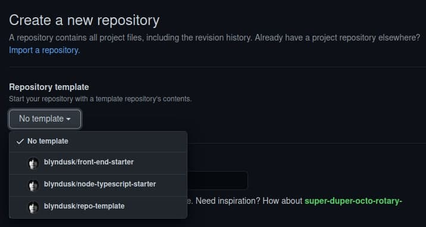

# repo-template

[](https://github.com/blyndusk/repo-template/releases)
[](https://github.com/blyndusk/repo-template/commits/main)
[](https://github.com/blyndusk/repo-template/issues)
[](https://github.com/blyndusk/repo-template/pulls) 
[](https://github.com/blyndusk/repo-template/commits/main)
[](https://github.com/blyndusk/repo-template/blob/main/LICENSE) 
[](https://github.com/blyndusk/repo-template) 

[](https://github.com/blyndusk/repo-template/actions/workflows/docker.yml) 
[](https://github.com/blyndusk/repo-template/actions/workflows/python.yml)
[](https://github.com/blyndusk/repo-template/actions/workflows/release.yml)

- [repo-template](#repo-template)
  - [I - Goal](#i---goal)
  - [II - Conventions, templates and guidelines](#ii---conventions-templates-and-guidelines)
    - [A - Commit conventions](#a---commit-conventions)
    - [B - Issue template](#b---issue-template)
    - [C - Branch naming convention](#c---branch-naming-convention)
    - [D - Pull request template](#d---pull-request-template)
  - [III - Use](#iii---use)
  - [IV - Project use](#iv---project-use)
    - [Help](#help)
    - [Start](#start)
    - [Stop](#stop)
    - [Restart](#restart)
    - [Display logs](#display-logs)
  - [V - License](#v---license)

## I - Goal

The purpose of this repository is to provide a solid, complete and adaptable base of a quasi-virgin repository, in order to start a new project with a maximum time saving.

This repository provides:
  - commit/branch/issues/pull requests conventions, templates and guidelines
  - GitHub Actions for CI, CD and release
  

## II - Conventions, templates and guidelines

### A - Commit conventions

```
tag(scope): #issue_id message
```

See [commit_conventions.md](.github/commit_conventions.md) for more informations.

### B - Issue template

See [user-story.md](.github/ISSUE_TEMPLATE/user-story.md) for more informations.

### C - Branch naming convention

```
type_scope-of-the-work
```

See [branch_naming_convention.md](.github/branch_naming_convention.md) for more informations.

### D - Pull request template

See [pull_request_template.md](.github/pull_request_template.md) for more informations.

## III - Use

Go to `New Repository`, then choose this template




## IV - Project use

### Help

```bash
$ make help
```

### Start

```bash
$ make start
```

### Stop

```bash
$ make start
```

### Restart

```bash
$ make restart
```

### Display logs

```bash
$ make logs
```

## V - License

Under [MIT](./LICENSE) license.
